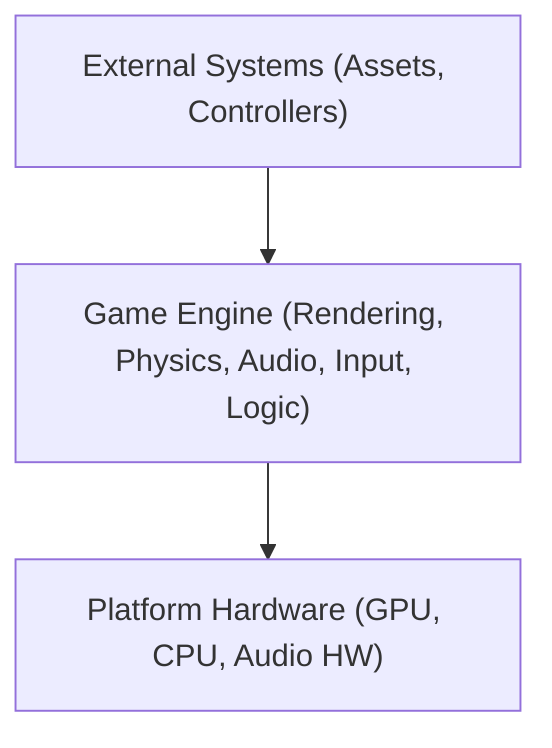
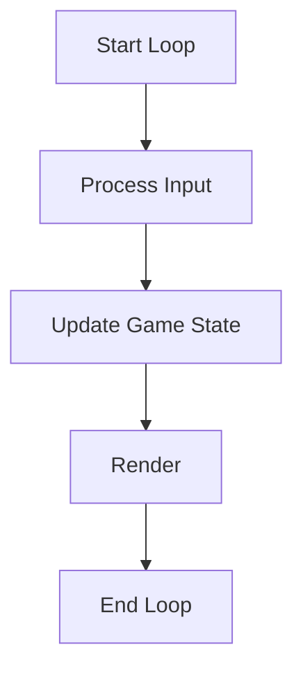

# Technical Design Document (TDD) for C++ Game Engine

## Document Header
- **Project Title:** C++ Game Engine Project
- **Version:** 1.0
- **Date:** 2026-02-02
- **Author(s):** RODRIGUES Julien, LOVISA Emilien, MARTIN Axel, COSSARDEAUX Antoine, BROSSARD Sacha
- **Contact:** [your.email@example.com]

## Revision History
| Date       | Version | Description                | Author      |
|------------|---------|----------------------------|-------------|
| 2026-02-03 | 1.0     | Initial document creation  | RODRIGUES Julien |

## Table of Contents
1. [Introduction](#1-introduction)
2. [System Overview](#2-system-overview)
3. [Requirements](#3-requirements)
4. [System Architecture & Design](#4-system-architecture--design)
5. [Detailed Module Design](#5-detailed-module-design)
6. [Interface Design](#6-interface-design)
7. [Performance and Optimization](#7-performance-and-optimization)
8. [Tools, Environment, and Deployment](#8-tools-environment-and-deployment)
9. [Project Timeline and Milestones](#9-project-timeline-and-milestones)
10. [Appendices](#10-appendices)

---

## 1. Introduction

### 1.1 Purpose
This document outlines the technical design for a modular C++ Game Engine, detailing its architecture and modules.

### 1.2 Scope
- **Objective:** Develop a game engine for rendering, physics, audio, and input management.
- **Application:** Real-time game development and academic projects.

### 1.3 Definitions, Acronyms, and Abbreviations  
- **API:** Application Programming Interface  
- **FPS:** Frames Per Second  
- **IDE:** Integrated Development Environment

### 1.4 References
- [C++ Standard Documentation](https://isocpp.org)

### 1.5 Document Overview
This TDD details the design, module interactions, and testing strategies for the game engine, ensuring clarity from high-level architecture to low-level implementation details.

---

## 2. System Overview

### 2.1 High-Level Description
The engine is a modular system written in C++ (C++20), designed to manage rendering, physics simulation, audio processing, and input handling in real-time.

### 2.2 System Context Diagram



### 2.3 Major Components
- **Rendering Engine:** Handles graphics using Vulkan.
    - Why Vulkan ? : Futureproof; Allows deep understanding and learning of the rendering pipeline; Multiplatform support;
    - Why not OpenGL : Too basic; No longer updated / supported;
    - Why not Dx11 : Slowly replaced by Dx12; Only available for Windows;
    - Why not Dx12 : Only available for Windows;
                         
- **Physics Engine:** Manages collision detection and physics simulations using Jolt.
      - Why Jolt ? : Easy to understand and implement; Modern C++ ;
      - Why not PhysX : Too hard to understand and implement; Not open-source
      - Why not Bullet : Old API; Documentation not updated;
- **Audio Engine:** Processes sound effects and music using FMOD.
      - Why FMOD ? : Most used overall (lots of documentation and support available) ; Lots of features;
      - Why not Mini Audio : Less features; Less adapted to Sound Design;
      - Why not OpenAL : Too old;
- **Input Manager:** Captures keyboard, mouse, and gamepad events.
- **Game Logic:** Integrates modules via a scripting interface.

---

## 3. Requirements

### 3.1 Functional Requirements
- Render 3D graphics with dynamic lighting and shading.
- Perform real-time physics simulation and collision detection.
- Play background music and trigger sound effects.
- Capture and process user inputs.
- Provide a scripting interface for game behavior customization.
- Use multithreading to separate game/physics update and rendering. (Advanced feature)

### 3.2 Non-Functional Requirements
- **Performance:** Maintain a minimum of 60 FPS.
- **Scalability:** Modular design for easy extension.
- **Portability:** Support Windows.
- **Maintainability:** Clear code structure with thorough documentation.

### 3.3 Use Cases
- **Rendering:** Load and display complex scenes.
- **Physics:** Update object states and detect collisions.
- **Audio:** Manage and play audio assets.
- **Input:** Map user actions to game events.

### 3.4 Design Constraints and Assumptions
- Use modern C++ (C++20).
- Rely on hardware-accelerated graphics.
- Assume a minimum hardware configuration for target platforms.

---

## 4. System Architecture & Design

### 4.1 Architectural Overview
The engine employs a component-based architecture. Each module has well-defined interfaces, ensuring loose coupling and isolated development.

### 4.2 Module Breakdown
- **Rendering Module:** Handles shaders, textures, and communicates with the GPU.
- **Physics Module:** Implements collision detection and rigid body dynamics.
- **Audio Module:** Interfaces with audio libraries (e.g., OpenAL).
- **Input Module:** Abstracts device-specific input.
- **Game Logic Module:** Manages scripting and event coordination.

### 4.3 Interaction Diagrams

#### Sequence Diagram: Rendering a Frame
```

User Input -> Game Logic -> Rendering Module -> GPU

```

#### Game Loop Flowchart


### 4.4 Design Decisions and Rationale
- **Language Choice:** C++ for high performance.
- **Modular Design:** Supports isolated testing and independent module development.

---

## 5. Detailed Module Design

### 5.1 Class Diagrams and Data Structures
- **Rendering:** `Renderer`, `Shader`, `Texture`
- **Physics:** `PhysicsEngine`, `Collider`, `RigidBody`, `PhysicsWorld`
- **Audio:** `AudioEngine`, `Sound`, `MusicPlayer`
- **Input:** `InputManager`, `Controller`
- **Editor** `UIManager`, ``

### 5.2 Key Algorithms and Code Snippets

#### Basic Rendering Loop in C++
```cpp
#include <iostream>
#include "Renderer.h"

int main() {
    Renderer renderer;
    if (!renderer.initialize()) {
        std::cerr << "Renderer initialization failed." << std::endl;
        return -1;
    }
    
    while (renderer.isRunning()) {
        renderer.processInput();
        renderer.updateScene();
        renderer.renderFrame();
    }
    
    renderer.shutdown();
    return 0;
}
````

### 5.3 Error Handling and Logging

- Utilize exception handling for critical errors.
- Implement a logging system to record runtime events and performance metrics.

---

## 6. Interface Design

### 6.1 Internal Interfaces

- Define clear APIs between modules using abstract classes or interfaces.

### 6.2 External APIs and File Formats

- Support standard file formats: OBJ (models), PNG (textures), WAV (audio).
- Provide documentation for external scripting interfaces.

### 6.3 User Interface (if applicable)

- Develop a debug UI for real-time performance monitoring and diagnostics.

---

## 7. Performance and Optimization

### 7.1 Performance Goals

- Consistently achieve 60 FPS.
- Optimize memory usage and processing overhead.

### 7.2 Optimization Techniques

- Use object pooling and memory management best practices.
- Implement batching and frustum culling in the rendering process.

---

## 8. Tools, Environment, and Deployment

### 8.1 Development Tools and IDEs

- Recommended IDEs: Visual Studio.
- Code editors that support C++20 features.

### 8.2 Build System and Automation

- Use CMake for project configuration.
- Automate builds using CI/CD pipelines.

### 8.3 Version Control

- Use Git for version control.
- Adopt a clear branching strategy for feature development.

### 8.4 Deployment Environment

- Target platforms: Windows.
- Provide deployment instructions and environment setup guides.

---

## 9. Project Timeline and Milestones

- **Phase 1:** Requirement Analysis & Detailed Design
- **Phase 2:** Core Module Development (Rendering, Physics, Audio, Input)
- **Phase 3:** Integration and Testing
- **Phase 4:** Optimization and Final Deployment
- Outline milestones with deadlines and deliverables.

---

## 10. Appendices

### 10.1 Glossary

- **Game Engine:** The core framework managing all game processes.
- **Module:** A self-contained component providing specific functionality.
- **Shader:** A program executed on the GPU to control rendering.

